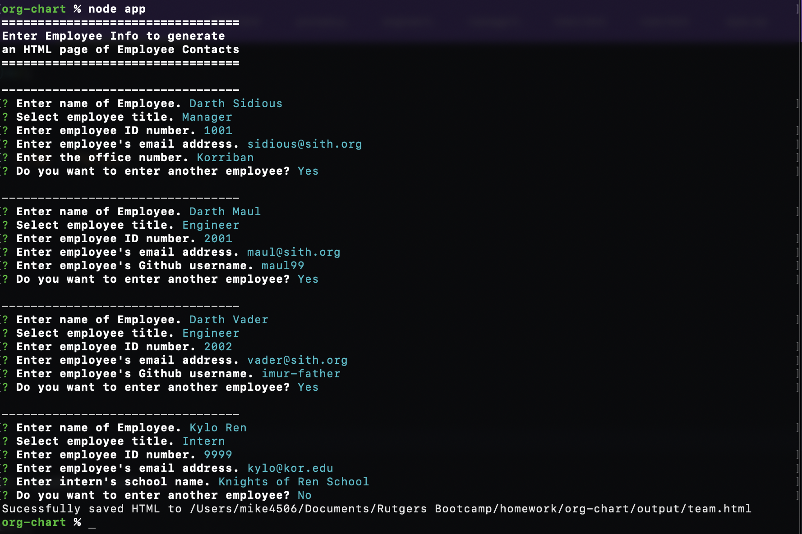

# Org Chart Generator 

## Description

This CLI app generates an html page of a Team consisting of a Manager, any number of Engineers, and any number of Interns.
Inputs are via prompts using Inquirer.js.

Deployed Site: <https://mc4506.github.io/org-chart/output/team.html>

## Table of Contents

* [Installation](#installation)
* [Usage](#usage)
* [License](#license)

## Installation

Clone this repo and install dependencies.

## Usage

Follow on screen prompts to automatically render an HTML page of your team/organization structure.

```
npm install
node app.js

```



## License

Licensed under MIT License.

## Questions

Contact [mc4506](mailto:mike4506@gmail.com)
